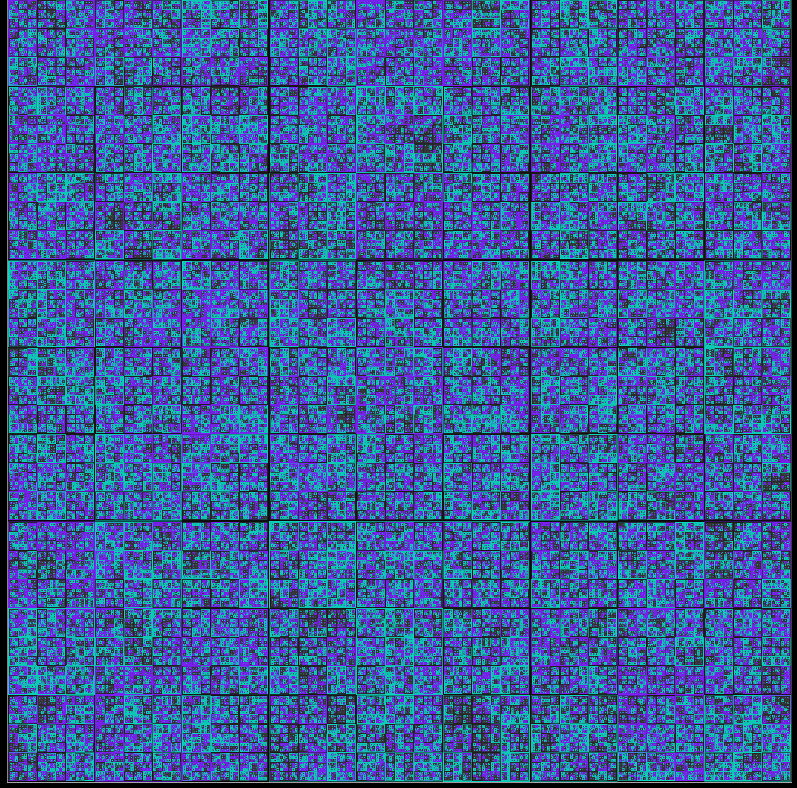

# Tic-Tac-Toe

Tic-Tac-Toe can be generalized by allowing each square of the board to contain its own, smaller Tic-Tac-Toe game. The small square in which the last mark was placed determines the large square in which the next mark must be placed. 

This program can run a game of this sort for any level of nestedness, n. 

Here's a randomly played game of size n = 7:

